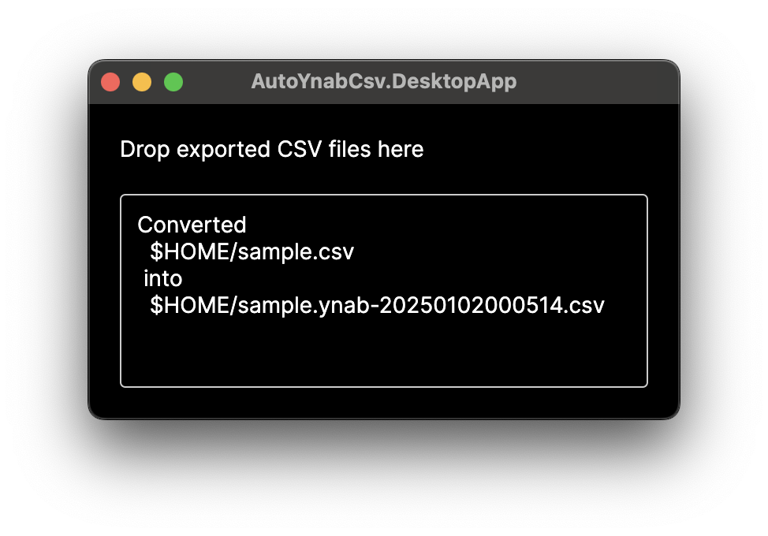

# auto-ynab-csv

> limited-use perpetual WIP automatic converter to [YNAB CSV](https://support.ynab.com/en_us/formatting-a-csv-file-an-overview-BJvczkuRq)

## Usage

```shell
auto-ynab-csv {exported.csv} > {converted.csv}
```

replacing the placeholders accordingly.

Alternatively, let the app create a file next to the original one:

```shell
auto-ynab-csv convert --input {exported.csv}
```

## GUI Usage

Drop the exported CSV files onto the app window.
The converted files will be put next to the dropped files.



## Installation

### Download a Release

- pick a [release](https://github.com/d-led/auto-ynab-csv/releases).
- download the desired artifact && unpack.
- On OSX you might need to run `sudo xattr -d com.apple.quarantine auto-ynab-csv` on the downloaded binary.

### Build Yourself

```shell
./scripts/build.sh
```

See the output for the binary location.

To build a Mac App bundle:

```shell
./scripts/build-app.sh
```

## Currently Supported Export Formats

- [n26 Download](https://support.n26.com/en-eu/account-and-personal-details/bank-statements-and-confirmations/how-to-get-bank-statement-n26)
- DKB Giro (new) CSV

## Alternatives

- [github.com/aniav/ynab-csv](https://github.com/aniav/ynab-csv) - manual number format conversion necessary afterwards, manual clean-up of CSV of summary lines that don't conform to the format

## Structure

- [Converters, Detectors, Exporters](./AutoYnabCsv/)
- [Console App](./AutoYnabCsv.ConsoleApp/)
- [Unit and Approval Tests](./AutoYnabCsv.Tests/)
    - see [data/samples](./data/samples) for sample inputs
    - see `*.approved.txt` for approved converted files
